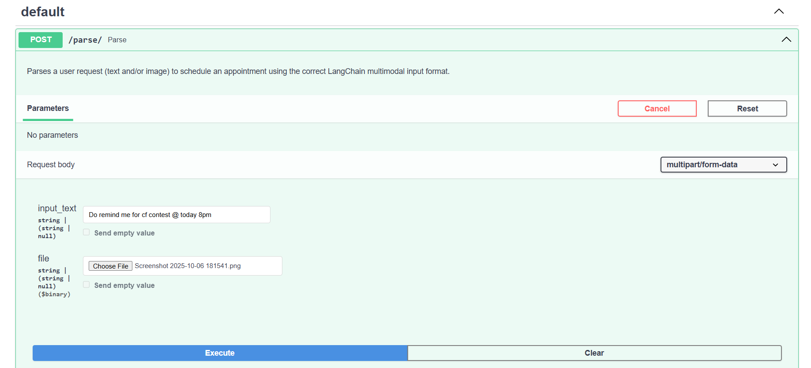
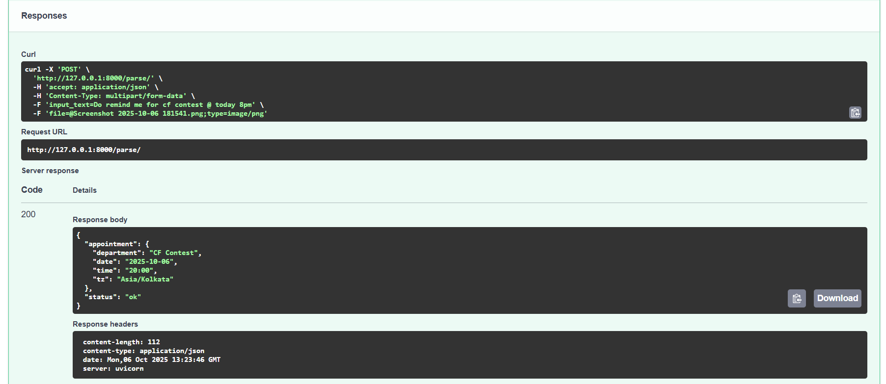

# AI-Powered Appointment Scheduler Assistant

This project is an **AI-powered appointment scheduling assistant** that can process **text, images, or both** to extract and normalize appointment information into a **structured JSON format**. It leverages **Google Gemini (Gemini 2.5 Flash) via LangChain** and **FastAPI** for building a lightweight API backend.

---

## Features

- Accepts **text input**, **image input**, or **text + image**.
- Performs **OCR on images** (via Gemini model) to extract relevant information.
- Normalizes **appointment date and time** to standard formats:
  - Date: `YYYY-MM-DD`
  - Time: `HH:MM` (24-hour)
- Outputs a **structured JSON object** containing:

  ```json
  {
    "appointment": {
      "department": "Standardized Department Name",
      "date": "YYYY-MM-DD",
      "time": "HH:MM",
      "tz": "Asia/Kolkata"
    },
    "status": "ok"
  }
Handles ambiguous or missing information gracefully:


```json
{
  "status": "needs_clarification",
  "message": "Ambiguous or missing information."
}
```

- Fast and async processing via FastAPI.

- Tech Stack
Language: Python

- Server Framework: FastAPI, Pydantic

- Modeling Framework: LangChain

- Model: Google Gemini 2.5 Flash (via API)

- Other Libraries: base64, datetime, uvicorn, python-dotenv

- Installation
### 1. Clone the repository

```bash
git clone [https://github.com/yourusername/appointment-scheduler.git](https://github.com/yourusername/appointment-scheduler.git)
cd appointment-scheduler
```

### 2. Create a virtual environment

```bash
# Linux/Mac
python -m venv myenv
source myenv/bin/activate

# Windows
python -m venv myenv
myenv\Scripts\activate
```

### 3. Install dependencies
```bash
pip install -r requirements.txt
```

### 4. Create a .env file
Create a file named .env in the root directory with your Gemini API key: Google AI Studio

```code
GEMINI_API_KEY="your_api_key_here"
```
Running the Server
Start the FastAPI server with:

```bash
python main.py
```
Or with uvicorn directly for live reloading:

```bash
uvicorn main:app --reload --host 0.0.0.0 --port 8000
```

Open http://127.0.0.1:8000/docs to access the Swagger UI and test the API.

### API Usage
- Endpoint: /parse/

- Method: POST

- Content-Type: multipart/form-data

- Parameters:

1. input_text (optional): Text describing the appointment.

2. file (optional): Image file containing appointment information.

Note: At least one of input_text or file is required.

### Example Requests

- Text Only
```bash
curl -X POST "[http://127.0.0.1:8000/parse/](http://127.0.0.1:8000/parse/)" \
-F "input_text=Remind me to attend the team meeting tomorrow at 3 PM"
```

- Image Only
```bash
curl -X POST "[http://127.0.0.1:8000/parse/](http://127.0.0.1:8000/parse/)" \
-F "file=@/path/to/appointment_note.jpg"
```

- Text + Image

```bash
curl -X POST "[http://127.0.0.1:8000/parse/](http://127.0.0.1:8000/parse/)" \
-F "input_text=Schedule this appointment" \
-F "file=@/path/to/appointment_note.jpg"
```



Example Response (Success)
```json
{
  "appointment": {
    "department": "Cardiology",
    "date": "2025-10-08",
    "time": "14:30",
    "tz": "Asia/Kolkata"
  },
  "status": "ok"
}
```

Example Response (Needs Clarification)

```json
{
  "status": "needs_clarification",
  "message": "Ambiguous or missing information."
}
```
Example Response (Error Parsing)

```json
{
  "status": "error",
  "message": "Failed to parse the response from the AI model.",
  "raw_response": "..."
}
```




Code Structure
```bash
.
├── main.py              # FastAPI app and LLM integration
├── requirements.txt     # Python dependencies
├── .env                 # Environment variables (Gemini API key)
└── README.md            # Project documentation
```

How It Works
- The user sends a POST request with text, an image, or both to the /parse/ endpoint.

- The server validates the input and converts the image to base64 (if provided).

- A structured prompt is created for Gemini, including instructions, context (like the current date), and the user's data.

- The LangChain ChatGoogleGenerativeAI model is invoked with the multimodal prompt.

- The model processes the request and returns a JSON string as output.

- The server parses the JSON and returns it to the client.

### Future Improvements
1. Add automatic timezone detection based on user location.

2. Deploy as a WhatsApp / PushAI agent for direct user interaction.

3. Enhance multimodal capabilities to handle handwriting and scanned documents more robustly.

4. Add database integration to save and retrieve appointments.